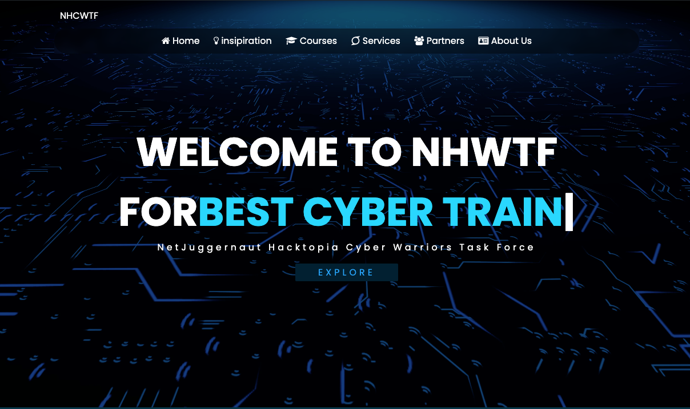

# NHWTF Official website

## Welcome to NHWTF

NetJuggernaut Hacktopia Cyber Warriors Task Force

### Description

This project showcases interactive cards built using Tailwind CSS, Vanilla JavaScript, and BootstrapIcons. The cards offer a visually appealing and engaging way to present information or functionality.

### Features:

Tailwind CSS: Leverages Tailwind's utility classes for rapid and responsive styling, ensuring your cards look great on any screen size.
Vanilla JavaScript: Employs pure JavaScript for interactive card behaviors, providing a lightweight and customizable approach.
BootstrapIcons: Integrates BootstrapIcons for a wide selection of visually attractive icons to enhance your cards' functionality and aesthetics.
Responsive Design: Ensures cards adapt seamlessly to different devices and screen sizes.
Technologies Used:

Tailwind CSS
Vanilla JavaScript
BootstrapIcons

### Developers
- Nkiko Hertier (https://rw.linkedin.com/in/nkiko-hertier-a9b2162aa)
- Imfura Thierry (https://linktr.ee/imfdabexxt)
